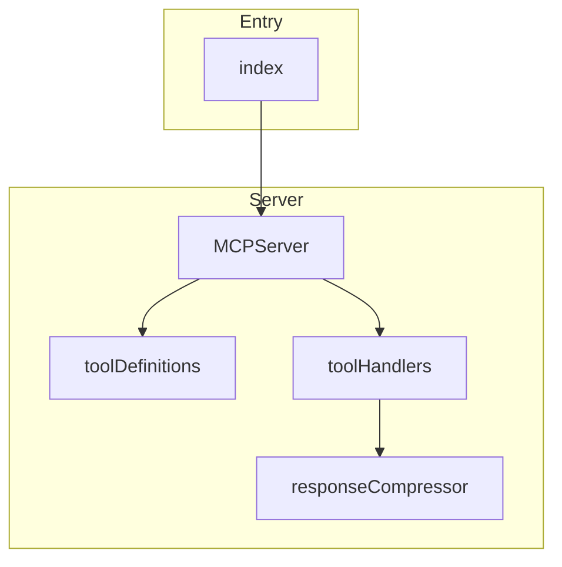

# @danielsimonjr/memory-mcp - Dependency Graph

**Version**: 12.7.0 | **Last Updated**: 2026-07-26

This document provides a comprehensive dependency graph of all files, components, imports, functions, and variables in the codebase.

---

## Table of Contents

1. [Overview](#overview)
2. [Entry Dependencies](#entry-dependencies)
3. [Server Dependencies](#server-dependencies)
4. [Dependency Matrix](#dependency-matrix)
5. [Circular Dependency Analysis](#circular-dependency-analysis)
6. [Visual Dependency Graph](#visual-dependency-graph)
7. [Summary Statistics](#summary-statistics)

---

## Overview

The codebase is organized into the following modules:

- **entry**: 1 file
- **server**: 4 files

---

## Entry Dependencies

### `src/index.ts` - MCP Memory Server Entry Point

**External Dependencies:**
| Package | Import |
|---------|--------|
| `@danielsimonjr/memoryjs` | `logger, defaultMemoryPath, ensureMemoryFilePath, ManagerContext, // Re-export types for backward compatibility
  type Entity, Relation, KnowledgeGraph, GraphStats, ValidationReport, ValidationIssue, ValidationWarning, SavedSearch, TagAlias, SearchResult, BooleanQueryNode, ImportResult, CompressionResult, // v1.7.0 new types
  type ArtifactEntity, ArtifactType, ArtifactFilter, FreshnessReport, AuditEntry, AuditOperation, RefEntry, RefIndexStats, AgentRole, RoleProfile, CognitiveLoadMetrics, AdaptiveReductionResult, SynthesisResult, FailureDistillationResult, DistilledLesson` |

**Internal Dependencies:**
| File | Imports | Type |
|------|---------|------|
| `./server/MCPServer.js` | `MCPServer` | Import |

**Exports:**

---

## Server Dependencies

### `src/server/MCPServer.ts` - MCP Server

**External Dependencies:**
| Package | Import |
|---------|--------|
| `@modelcontextprotocol/sdk/server/index.js` | `Server` |
| `@modelcontextprotocol/sdk/server/stdio.js` | `StdioServerTransport` |
| `@modelcontextprotocol/sdk/types.js` | `CallToolRequestSchema, ListToolsRequestSchema` |
| `@danielsimonjr/memoryjs` | `logger, ManagerContext` |

**Node.js Built-in Dependencies:**
| Module | Import |
|--------|--------|
| `module` | `createRequire` |

**Internal Dependencies:**
| File | Imports | Type |
|------|---------|------|
| `./toolDefinitions.js` | `toolDefinitions` | Import |
| `./toolHandlers.js` | `handleToolCall` | Import |

**Exports:**
- Classes: `MCPServer`

---

### `src/server/responseCompressor.ts` - MCP Response Compression Module

**External Dependencies:**
| Package | Import |
|---------|--------|
| `@danielsimonjr/memoryjs` | `compress, decompress, COMPRESSION_CONFIG` |

**Exports:**
- Interfaces: `CompressedResponse`, `ResponseCompressionOptions`
- Functions: `maybeCompressResponse`, `decompressResponse`, `isCompressedResponse`, `estimateCompressionRatio`

---

### `src/server/toolDefinitions.ts` - MCP Tool Definitions

**Exports:**
- Interfaces: `ToolDefinition`
- Constants: `toolDefinitions`

---

### `src/server/toolHandlers.ts` - MCP Tool Handlers

**External Dependencies:**
| Package | Import |
|---------|--------|
| `@danielsimonjr/memoryjs` | `formatToolResponse, formatTextResponse, formatRawResponse, validateWithSchema, validateFilePath, BatchCreateEntitiesSchema, BatchCreateRelationsSchema, EntityNamesSchema, DeleteRelationsSchema, AddObservationsInputSchema, DeleteObservationsInputSchema, ArchiveCriteriaSchema, SavedSearchInputSchema, SavedSearchUpdateSchema, ImportFormatSchema, ExtendedExportFormatSchema, MergeStrategySchema, ExportFilterSchema, SearchQuerySchema, HybridSearchManager, QueryAnalyzer, QueryPlanner, ReflectionManager, ObservationNormalizer, RefIndex, AuditLog, GovernanceManager, FreshnessManager, ArtifactManager, CollaborativeSynthesis, FailureDistillation, CognitiveLoadAnalyzer, ConsolidationScheduler, DreamEngine, DistillationPipeline, DefaultDistillationPolicy, NoOpDistillationPolicy, computeEntropy, passesEntropyFilter, EntropyFilterStage, getRoleProfile, listRoleProfiles, QueryCostEstimator, ContradictionDetector, PiiRedactor, ManagerContext, AgentRole, ArtifactFilter, CollaborativeSynthesisConfig, FailureDistillationConfig, AuditFilter, SalienceContext, AgentEntity, DreamEngineConfig, DreamPhaseConfig, ForgetOptions, ConflictInfo, ConflictStrategy` |
| `zod` | `z` |

**Node.js Built-in Dependencies:**
| Module | Import |
|--------|--------|
| `path` | `path` |

**Internal Dependencies:**
| File | Imports | Type |
|------|---------|------|
| `./responseCompressor.js` | `maybeCompressResponse` | Import |

**Exports:**
- Functions: `handleToolCall`
- Constants: `toolHandlers`

---

## Dependency Matrix

### File Import/Export Matrix

| File | Imports From | Exports To |
|------|--------------|------------|
| `index` | 1 files | 0 files |
| `MCPServer` | 2 files | 1 files |
| `responseCompressor` | 0 files | 1 files |
| `toolDefinitions` | 0 files | 1 files |
| `toolHandlers` | 1 files | 1 files |

---

## Circular Dependency Analysis

**No circular dependencies detected.**
---

## Visual Dependency Graph

---

## Summary Statistics

| Category | Count |
|----------|-------|
| Total TypeScript Files | 5 |
| Total Modules | 2 |
| Total Lines of Code | 7667 |
| Total Exports | 11 |
| Total Re-exports | 0 |
| Total Classes | 1 |
| Total Interfaces | 3 |
| Total Functions | 5 |
| Total Type Guards | 1 |
| Total Enums | 0 |
| Type-only Imports | 0 |
| Runtime Circular Deps | 0 |
| Type-only Circular Deps | 0 |

---

*Last Updated*: 2026-07-26
*Version*: 12.7.0
